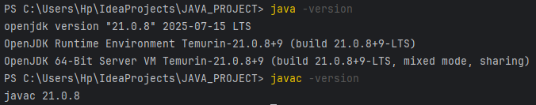
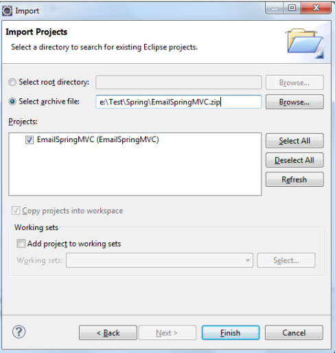

# CCRM - College Course Registration Management System

## Project Overview

CCRM is a comprehensive Java-based College Course Registration Management System that provides functionality for managing students, courses, enrollments, and academic transcripts. The system demonstrates advanced Java programming concepts including object-oriented design, exception handling, file I/O operations, and stream processing.

For detailed problem statement, scope, and target users, see [statement.md](statement.md).

---

## Table of Contents
- [Features](#features)
- [Technologies Used](#technologies-used)
- [Prerequisites](#prerequisites)
- [Installation & Setup](#installation--setup)
- [How to Run](#how-to-run)
- [Usage Guide](#usage-guide)
- [Project Structure & Syllabus Mapping](#project-structure--syllabus-mapping)
- [Screenshots](#screenshots)

---

## Features

### 1. Student Management
- Add new students with registration number, name, and email
- Search students by partial name matching
- Update student contact information
- View complete student roster

### 2. Course Management
- Create courses using flexible Builder pattern
- Browse and search course catalog
- Filter courses by department
- Manage course metadata

### 3. Enrollment & Grading
- Enroll students in courses with validation
- Credit limit enforcement (prevents over-enrollment)
- Duplicate enrollment prevention
- Grade assignment (S/A/B/C/D/F grading system)

### 4. Reports & Analytics
- Generate comprehensive student transcripts
- Weighted GPA calculation (grade points × credits)
- GPA distribution analysis

### 5. Data Management
- CSV-based data import/export
- Automated backup system with timestamp
- File-based storage in configurable data folder

---

## Technologies Used

- **Language**: Java 11+ (tested with JDK 17)
- **IDE**: Eclipse IDE / IntelliJ IDEA
- **Data Storage**: File-based CSV storage
- **Design Patterns**: Builder Pattern, Singleton Pattern, Service Layer Pattern
- **Key Java Features**: Stream API, Lambda Expressions, Optional, Record Classes, Collections Framework, Exception Handling, File I/O (NIO)

---

## Prerequisites

- **JDK 11 or higher** (recommended: Oracle JDK 17 or OpenJDK 17)
- **Eclipse IDE** (2023-03 or later) or **IntelliJ IDEA**
- Minimum **4GB RAM**, **2GB free disk space**

---

## Installation & Setup

### Windows JDK Installation

1. **Download JDK**
    - Visit [Oracle JDK](https://www.oracle.com/java/technologies/downloads/) or [OpenJDK](https://openjdk.org/)
    - Download Windows x64 installer

2. **Install JDK**
    - Run the installer as administrator
    - Note installation path (e.g., `C:\Program Files\Java\jdk-17`)

3. **Set Environment Variables**
    - Open System Properties → Advanced → Environment Variables
    - Add `JAVA_HOME`: `C:\Program Files\Java\jdk-17`
    - Update `PATH`: Add `%JAVA_HOME%\bin`

4. **Verify Installation**
```bash
   java -version
   javac -version
```

   

### Eclipse IDE Setup

1. **Download Eclipse**
    - Visit [Eclipse Downloads](https://www.eclipse.org/downloads/)
    - Download Eclipse IDE for Java Developers

2. **Import Project**
    - File → Import → General → Existing Projects into Workspace
    - Browse to CCRM project folder
    - Select project and click Finish

   

---

## How to Run
```bash
# Clone the repository
git clone https://github.com/himanshisonkusale/ProjectJava.git
cd JAVA_PROJECT

# Compile the project
javac -d bin -cp src src/edu/ccrm/cli/MainMenu.java

# Run the main application
java -cp bin edu.ccrm.cli.MainMenu

# Run with assertions enabled
java -ea -cp bin edu.ccrm.cli.MainMenu

# Run with custom data folder
java -Ddata.folder=./custom-data -cp bin edu.ccrm.cli.MainMenu
```

---

## Usage Guide

### Main Menu Options
```
=== CCRM - College Course Registration Management ===
1. Manage Students
2. Manage Courses
3. Manage Enrollments
4. Generate Transcript
5. Show GPA Distribution
6. Backup System Data
7. Import/Export Data
0. Exit
```

### Sample CSV Data Files

The `test-data/` folder contains sample CSV files:

**students.csv:**
```csv
RegNo,FirstName,LastName,Email
CS001,John,Doe,john.doe@university.edu
CS002,Jane,Smith,jane.smith@university.edu
```

**courses.csv:**
```csv
Code,Title,Credits,Department,Semester
CS101,Programming Fundamentals,4,Computer Science,SPRING
CS102,Data Structures,4,Computer Science,FALL
```

**enrollments.csv:**
```csv
StudentRegNo,CourseCode,Grade
CS001,CS101,A
CS002,CS101,S
```

---

## Project Structure
```
JAVA_PROJECT/
├── src/
│   └── edu/ccrm/           # Source code packages
├── data/
│   ├── backup_*/           # Automated backup folders
│   ├── courses_export.csv
│   └── students_export.csv
├── Screenshots/            # Application screenshots
├── test-data/             # Sample CSV files
├── .gitignore
├── img.png                # Installation screenshots
├── img_1.png
├── img_2.png
├── README.md              # This file
├── statement.md           # Problem statement & scope
└── ss.md
```

---

## Project Structure & Syllabus Mapping

| Syllabus Topic | File/Class | Method/Concept | Description |
|----------------|------------|----------------|-------------|
| **Main Method & CLI** | `edu.ccrm.cli.MainMenu` | `main()`, `start()` | Application entry point, menu system |
| **Classes & Objects** | `edu.ccrm.domain.Student` | Constructor, getters/setters | Student entity with encapsulation |
| **Builder Pattern** | `edu.ccrm.domain.Course.Builder` | `code()`, `title()`, `build()` | Fluent API for object creation |
| **Enums** | `edu.ccrm.domain.Grade` | `S, A, B, C, D, F` | Grade enumeration with points |
| **Enums Advanced** | `edu.ccrm.domain.Semester` | `SPRING, FALL, SUMMER` | Semester enumeration |
| **Collections (List)** | `StudentService`, `CourseService` | `listAll()`, `ArrayList` | Student and course management |
| **Collections (Map)** | `MainMenu.showGpaDistribution()` | `HashMap<String, Double>` | GPA tracking and distribution |
| **Optional Class** | `StudentService.findByRegNo()` | `Optional<Student>` | Null-safe object handling |
| **Stream API** | `MainMenu.manageEnrollments()` | `filter()`, `toList()` | Filtering ungraded enrollments |
| **Stream Collectors** | `MainMenu.showGpaDistribution()` | `groupingBy()`, `counting()` | GPA distribution grouping |
| **Lambda Expressions** | `MainMenu.showGpaDistribution()` | `forEach()`, arrow functions | Functional programming |
| **Exception Handling** | `edu.ccrm.exceptions.*` | Try-catch blocks | Custom exceptions (DuplicateEnrollment) |
| **File I/O (NIO)** | `MainMenu.performBackup()` | `Files.copy()`, `DirectoryStream` | File operations and backup |
| **Recursion** | `edu.ccrm.util.RecursionUtil` | `calculateDirectorySize()` | Recursive directory traversal |
| **Configuration** | `edu.ccrm.config.AppConfig` | Singleton pattern | Application configuration |
| **Service Layer** | `edu.ccrm.service.*` | Business logic separation | Service-oriented architecture |
| **Switch Expressions** | `MainMenu.start()` | `case "1" ->` | Modern switch syntax (Java 14+) |
| **Record Classes** | `edu.ccrm.domain.Name` | Immutable data carriers | Modern Java record syntax |
| **Import/Export** | `edu.ccrm.io.ImportExportService` | CSV file processing | Data persistence |
| **Transcript Generation** | `edu.ccrm.service.TranscriptService` | `generateTranscript()` | Report generation |

---

## Running with Assertions

Assertions help validate program correctness during development:
```bash
# Enable all assertions
java -ea -cp bin edu.ccrm.cli.MainMenu

# Run with system assertions and custom data folder
java -esa -ea -Ddata.folder=./test-data -cp bin edu.ccrm.cli.MainMenu
```

**Assertion Examples:**
```java
// Credit limit validation
assert totalCredits <= maxCredits : "Total credits exceed limit: " + totalCredits;

// Student registration validation
assert regNo != null && !regNo.isEmpty() : "Registration number cannot be empty";
```

---

## Screenshots

### Main Menu Interface


### Student Management


### Enrollment Process


### Transcript Generation


---

## Repository

**GitHub**: [https://github.com/himanshisonkusale/JAVA_PROJECT](https://github.com/sachijhaa/JAVA_PROJECT)  
**Documentation**: See [statement.md](statement.md) for complete problem statement, scope, and target users

---

## Contributing

Contributions, issues, and feature requests are welcome! Feel free to check the issues page or submit a pull request.

---

## License

This project is developed as part of academic coursework at VITyarthi.

---

*Built with ☕ Java | Designed for efficient course registration management*